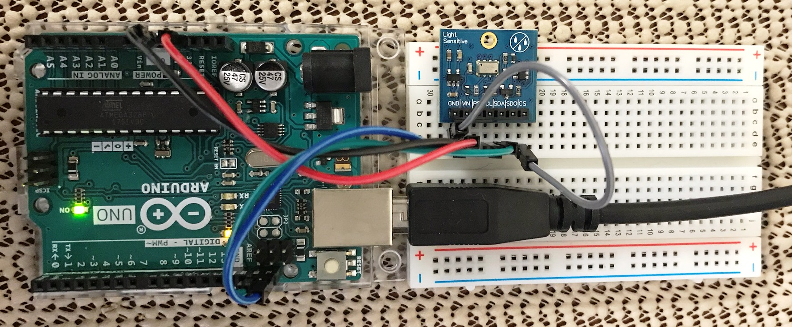
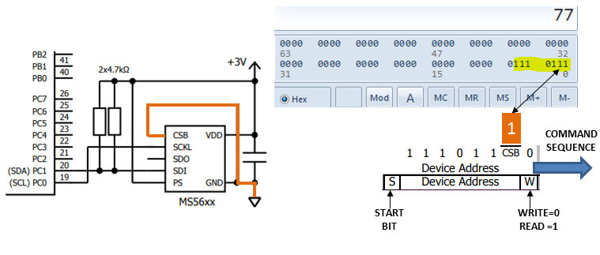
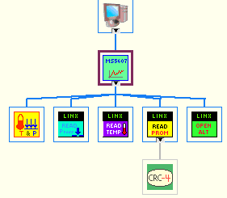
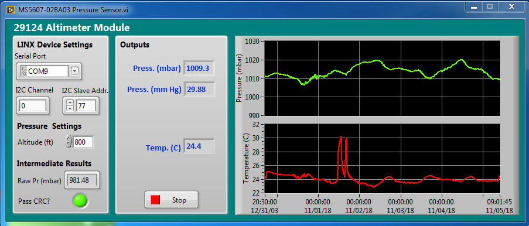

## Parallax MS5607 Altimeter Logger using Arduino-LabVIEW

The purpose of this development exercise was to create a data logging application for the [Parallax MS5607 Altimeter Module](https://www.parallax.com/product/29124). The altimeter module is a breakout board for the [MS5607-02BA03 Barometric Pressure Sensor](https://www.te.com/commerce/DocumentDelivery/DDEController?Action=showdoc&DocId=Data+Sheet%7FMS5607-02BA03%7FB2%7Fpdf%7FEnglish%7FENG_DS_MS5607-02BA03_B2.pdf%7FCAT-BLPS0035) offered by TE Connectivity. The sensor provides pressure and temperature data over an I2C bus that is acquired through ab Arduino and displayed on a PC using LabVIEW. The sensor has high resolution and can discern changes in altitude as small as 20cm (50.8 in).
### Hardware 
The setup is very simple. The altimeter module is mounted on a breadboard and is connected to 3V power and I2C on the Arduino.
*Hardware Setup*
### I2C Setup
All I2C command byte sequences (Reset, PROM Read, Conversion and CRC Check) begin with transmitting the device address. The device address is a fixed bit sequence except that bit two, the CSB bit, can be set to either 1 or 0 which allows for two sensors with different addresses. The breakout board grounds the CSB pin which effectively sets bit two to logic 1, since the pin is active low. This results in the **device address of 0x77**.  
*Derivation of the Device Address*
### LabVIEW Architecture
  *LabVIEW Architecture*
  
  

### LabVIEW Output
*Front Panel with Acquired Data*